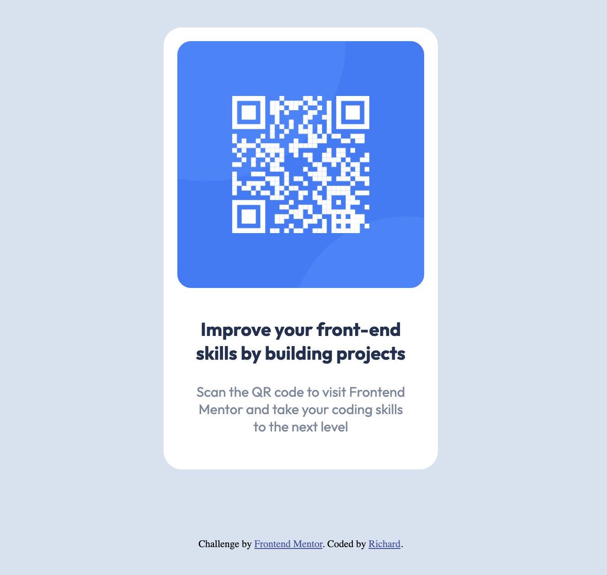

# Frontend Mentor - QR Code Component

This is a solution to the [QR code component challenge on Frontend Mentor](https://www.frontendmentor.io/challenges/qr-code-component-iux_sIO_H). Frontend Mentor challenges help you improve your coding skills by building realistic projects.

## Table of contents

- [Overview](#overview)
  - [Screenshot](#screenshot)
  - [Links](#links)
- [My process](#my-process)
  - [Built with](#built-with)
  - [What I learned](#what-i-learned)

## Overview

### Screenshot

### Links

- Solution URL: [https://github.com/r-tom90/QR-Code-Component](https://github.com/r-tom90/QR-Code-Component)
- Live Site URL: [ https://r-tom90.github.io/QR-Code-Component/](https://r-tom90.github.io/QR-Code-Component/)

## My process

### Built with

- Semantic HTML5 markup
- CSS custom properties
- Flexbox

### What I learned

Starting to apply the knowledge of the first HTML and CSS based project and becoming better at it. Need to understand a lot more overtime when to use display as flex compared to blocks, inline and inline-blocks along with box-sizing.
